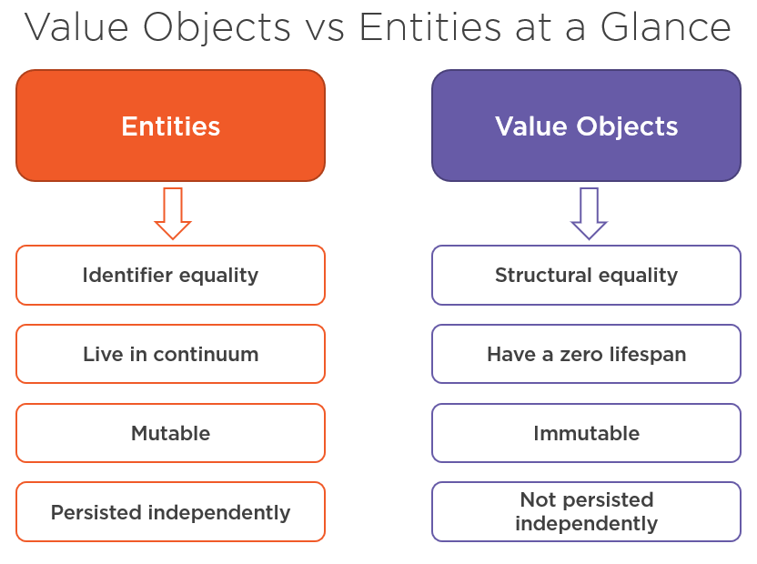

# Value Objects

**Value Objects** are one of the building blocks of Domain-Driven Design.

The concept of Value object is often confusing. This repo tries to explain [what they are](#what-are-value-objects) and presents some [examples](#value-objects-through-examples) in case they come in handy for anyone else.

## What is Domain-Driven Design?

**Domain-Driven design** (DDD) is a major software design approach, focusing on modeling software to match a domain according to input from that domain's experts. It provides a set of tools, concepts, and best practices to help achieve this goal.

## What are Value Objects?

According to the definition from the Domain-Driven Design book:

> “*An object that represents a descriptive aspect of the domain with no conceptual identity is called a Value Object. Value Objects are instantiated to represent elements of the design that we care about only for what they are, not who or which they are.*”

— Eric Evans

In other words, Value objects don’t have their own identity. That is, we don’t care if a value object is the same physical object we had before or another one with the same set of properties. Value Objects are completely interchangeable.

We can say that Value objects encapsulate a set of primitive values and related invariants. A few examples of value objects are money, an email, and date range objects:
- Money consists of an amount and currency.
- An email represents and email address and ensures that its value is correct. 
- A date range consists of start and end dates.

## Entity vs Value Objects

As mentioned, Value objects are different from Entities - they don't have a concept of identity. They encapsulate primitive types in the domain and solve [primitive obsession](https://refactoring.guru/smells/primitive-obsession).

There are two main characteristics for Value objects:

- They have no identity.

- They are immutable.

Another quality of value objects is structural equality. Two value objects are equal if their values are the same. This quality is the least important in practice. However, there are cases where you want only some values to determine equality.

In summary:



Additionally, there exists a hierarchical relationship between Entities and Value objects, where Entities serve as parents of Value objects.

In any case, the composition of objects also applies to Value objects. That is, a Value object can be formed by other Value objects.

## Why Should We Use Value Objects?

There are numerous reasons to invest time to introduce value objects into a project, let’s look at some.

### Encapsulation

Encapsulation basically means to **group logically bound properties together, hide and preserve the integrity of any internal state**.

### Validation 

Validation is a key concept in Domain-Driven Design. **We must ensure that our domain model is in a valid state at all times**. Thus every Entity and Value object is responsible for its own validity.

### Immutability

**Immutability means that once we instantiate an object, none of its properties can change**. Effectively it means a read-only object. If you want to change an individual value, you need to replace the entire Value object.

### Type Safety

Sometimes we see a signature containing multiple parameters of the same primitive types:

```csharp
public interface ITicketPriceProvider
{
    decimal GetTicketPrice(
        string originCountry,
        string destinationCountry,
        string originStation,
        string destinationStation);
}
```

In this case, we can use Value objects to type and differentiate them:

```csharp
public record Money(decimal Amount, string Currency);
public record Station(string StationCode, string StationName);
public record Country(string CountryCode, string CountryName);
```

This way, we are able to rearrange the method parameters in a clearer way:

```csharp
public interface ITicketPriceProvider
{
    Money GetTicketPrice(
        Country originCountry,
        Country destinationCountry,
        Station originStation,
        Station destinationStation);
}
```

## Value Objects as Records

Due to [Immutability](#immutability), **records** would be a good candidate to implement Value Objects, but as drawbacks we have to take into account that records do not implement IComparable, and regarding [Encapsulation](#encapsulation), all their internal properties become public, and there are cases where we do not want this.

So in this case we decided to implement all our examples using **classes**.

## Value Objects through Examples

Here are a few examples of Value objects. However, the following disclaimers should be taken into account beforehand:

> [!NOTE]
> As explained, consider that it’s not always clear if a concept is an Entity or a Value object, because it depends on your specific domain model.

> [!CAUTION]
> Additionally, the validation rules in each Value object may also vary depending on the domain model.

With these warnings in mind, I have created some new Value objects to replace common primitive types, that can be use in other Entities. These examples are presented in case they are useful to anyone else.

**Named constructors** are used in almost all the Value objects presented except in some cases such as [Coordinates](./ValueObjects/Location/Coordinates.cs), which serves as an example of a [test](./ValueObject.Tests/Location/CoordinatesTests.cs) for implicit operators. Some others allow duality of constructors, as in the case of [Price](./ValueObjects/Money/Price.cs). In the specific case of Price, a **deconstructor** has also been implemented as an example.

Some of the Value object examples presented are:

- [Address](./ValueObjects/Contacts/Address.cs)

  In this example, the **Address** type has been build as a set of Street, City, State, ZipCode, and the [Country](./ValueObjects/Contacts/Country.cs) Value object. The properties of an Address could be adapted as required.

- [Country](./ValueObjects/Contacts/Country.cs)

  The **Country** type is identified from the two-letter ISO region name. The [Countries](./ValueObjects/Contacts/Countries.cs) list allows to identify all valid country codes. Instead of the two-letter ISO region name, the list of three-letter ISO region names could also be used if necessary.

- [PersonName](./ValueObjects/Contacts/PersonName.cs)

  A **person name** can be broken own into multiple parts: first name, middle name, last name, title and suffix. All these data can be wrapped in a single type.

- [PhoneNumber](./ValueObjects/Contacts/PhoneNumber.cs)

  As with email addresses, **telephone numbers** require validation. However, validating phone numbers is very complex and can vary depending on country, region, if it’s a landline or mobile etc. So, I here kept the validation very simple for this example implementation. Feel free to add your own custom validation.

- [DateRange](./ValueObjects/Dates/DateRange.cs)

  The **DateRange** type simply represents a start and end date. No only does it make our code cleaner, but it also allows us to provide methods for things like checking if a given date is within the date range.

- [Color](./ValueObjects/Images/Color.cs)

  The **Color** concept can be created in this example from RGB or HLS. In the case of RGB, the [Intensity](./ValueObjects/Images/Intensity.cs) Value Object is used to identify the intensity value of red, green or blue. While for HLS the respective [Hue](./ValueObjects/Images/Hue.cs), [Saturation](./ValueObjects/Images/Saturation.cs) and [Lightness](./ValueObjects/Images/Lightness.cs) Value objects are used, and the corresponding conversion to RGB is applied.

- [Coordinates](./ValueObjects/Location/Coordinates.cs)

  The **Coordinates** type is defined according to the corresponding [Latitude](./ValueObjects/Location/Latitude.cs) and [Longitude](./ValueObjects/Location/Longitude.cs) Value objects. It also provides a method to calculate the distance to another Coordinates.

- [Price](./ValueObjects/Money/Price.cs)

  The **Price** implementation relies on the [Amount](./ValueObjects/Money/Amount.cs) and [Currency](./ValueObjects/Money/Currency.cs) Value objects. The [Currencies](./ValueObjects/Money/Currencies.cs) list allows to check which currency codes are valid.

- [Email](./ValueObjects/Network/Email.cs)

  The **Email** type encapsulates validation in one place. Now there is no need to repeat validation logic in multiple places, or create a separate helper class for reuse. We could just use the built-in type `System.Net.Mail.MailAddress` to do the same thing, but `MailAddress` is not a value object, so it wouldn’t work in the way we want it to.

- [WebAddress](./ValueObjects/Network/WebAddress.cs)

  The **WebAddress** type encapsulates validation for a web based URL. This essentially wraps the `System.Uri` type, but as a value object.
 